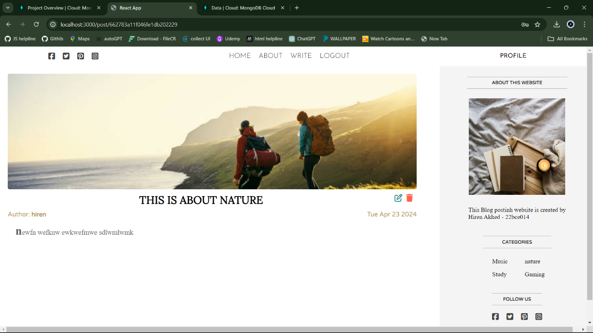
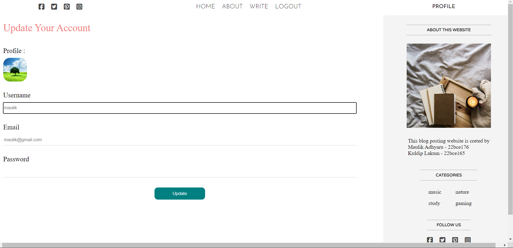
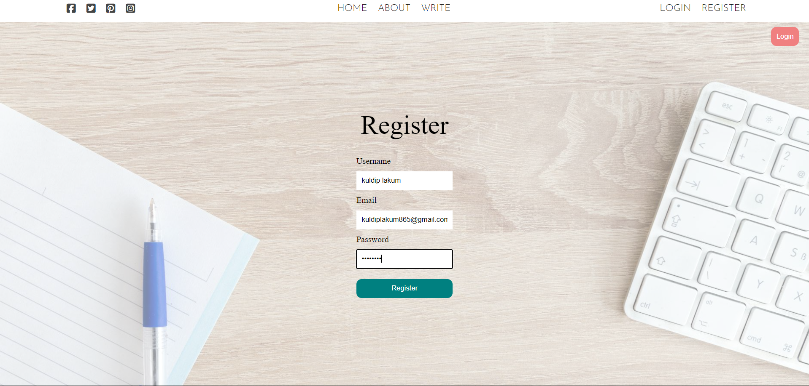
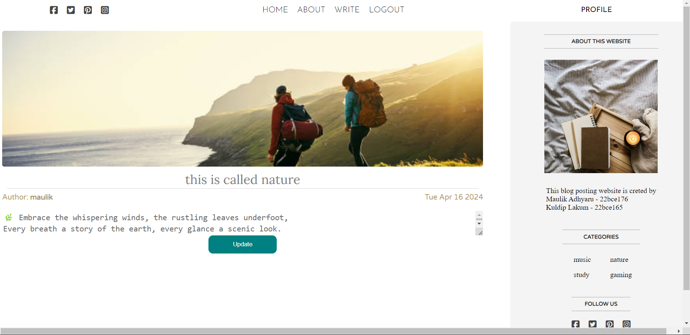

Blog Posting Website (MERN Stack)

This blog posting website is built using the MERN stack, incorporating MongoDB, Express.js, React.js, and Node.js. It offers a modern, scalable, and efficient solution for managing and publishing blog content. Key features include:

Multiple Page Functionality: Includes a Home Page, About Page, Login and Register Pages, and a Post Classification system.
User Authentication: Secure login and registration for multiple users, with personalized account management.
Dynamic Blog Post Creation: Intuitive interface for creating, editing, and deleting posts with rich text formatting and multimedia support.
Author and Category Classification: Posts are organized by author and category, enhancing content discoverability and organization.
Explore and contribute to the development of this dynamic blogging platform!

Here are some images of websites

